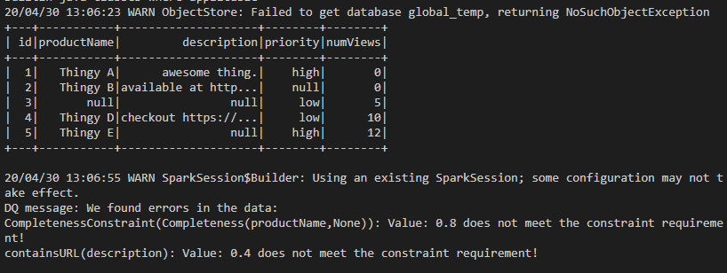

# pyspark_amazon_deequ_example
Simple example of running Amazon Deequ on Pyspark DataFrame through JVM

first build the jar with

```
gradle shadowJar
```

then run python script

```
python dataoptimization.py
```

If things runs fine, you could see:



Note:

1. "in" is a python reserved word, when importing java (dataoptimization.py line: 15), there should not be any "in" (or any other python reserved word) in the classpath.